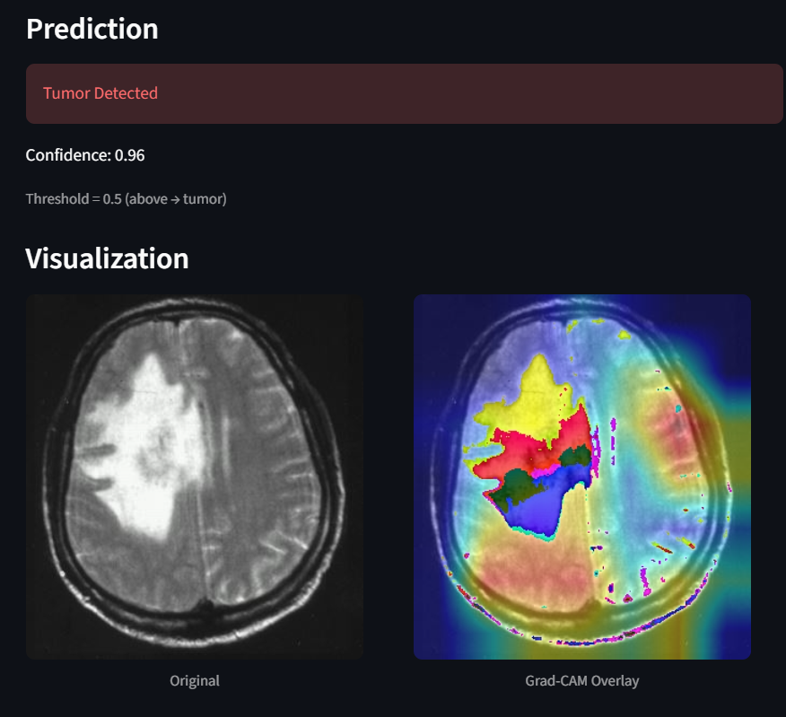
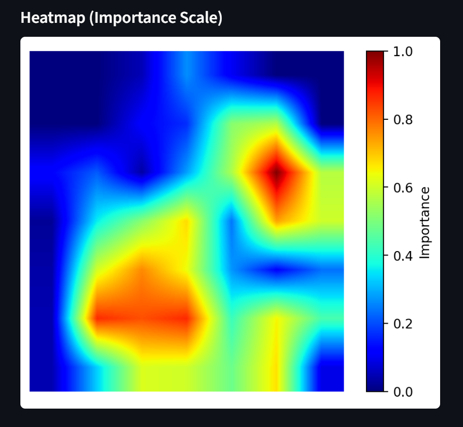

#Brain Tumor Detection using ResNet50 and Grad-CAM

##This project uses a deep learning model to classify MRI images as **Tumor** or **No Tumor** and provides visual explanations using Grad-CAM.

##MODEL
- ResNet50 (pretrained on ImageNet)
- Transfer Learning (frozen base)
- Binary Classification

##Features
- Tumor prediction with confidence score
- Grad-CAM visualization
- Heatmap with importance scale
- Streamlit web app

##Demo
Upload an MRI image → get prediction + explanation

Run locally
```bash
pip install -r requirements.txt
streamlit run app.py

##  Results

### Prediction + Grad-CAM


### Heatmap Visualization

